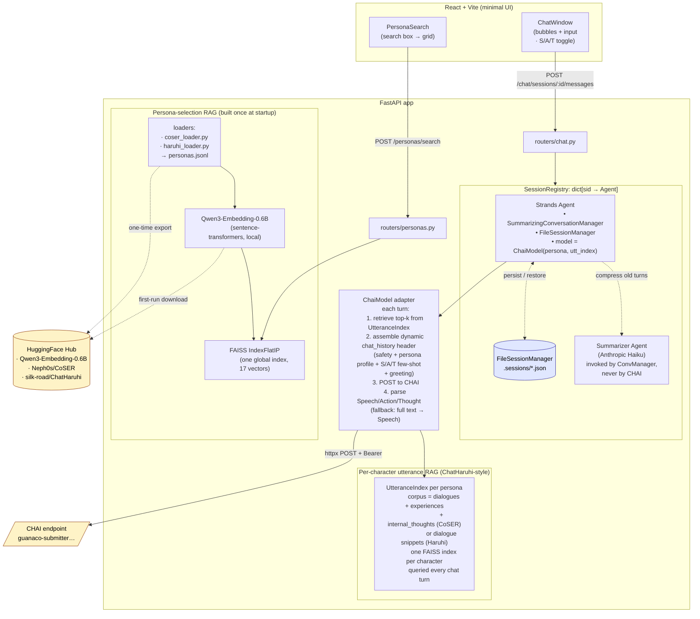
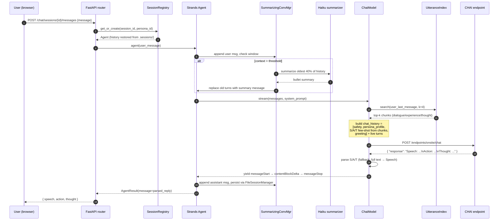

# RolePlay Chatbot — Task 1 Design

## Context

Task 1 of `OVERALL.md`: a role-play chatbot where a user picks a character and chats with it via CHAI's stateless model API.

User-driven requirements:

- **Backend**: FastAPI + Python 3.13, agent built with **Strands Agents SDK**.
- **Frontend**: minimal React + Vite — character picker + chat window.
- **Persona library**: **17 characters total**, sourced **only from public datasets** (no LLM synthesis):
  - **16 from CoSER** (`Neph0s/CoSER`, ICML 2025) — literary characters with structured `profile / experiences / internal_thoughts / dialogues`.
  - **1 from ChatHaruhi** (`silk-road/ChatHaruhi-54K-Role-Playing-Dialogue`) — 凉宫春日 (Haruhi Suzumiya), the canonical anime persona of that dataset.
  - Anime/film characters that exist in *neither* dataset (Gojo, Levi, Tony Stark, etc.) are **out of scope** — we don't synthesize.
- **Two-layer RAG**:
  1. **Persona-selection RAG** — user types "a brilliant overachiever" → embed query → top-k character cards.
  2. **Per-turn utterance RAG (ChatHaruhi-style)** — every chat turn, retrieve top-k chunks from the chosen character's CoSER/Haruhi corpus and inject them as in-character few-shot in CHAI's `chat_history` header.
- **No SFT**. CHAI is a hosted black box — RoleLLM's training pipeline is off-limits. Everything happens at inference time.
- **Speech / Action / Thought (S/A/T) output format** with **fallback switch**. CoSER's most demo-able feature; CHAI is not instruction-tuned for it, so we ship few-shot demonstrations + a robust parser + an env flag to disable.
- **Memory**: Strands `SummarizingConversationManager` (sliding window + rolling summary) + `FileSessionManager` for persistence. Tier-3 cross-session vector memory left as a documented hook.

This document covers Task 1 only. Task 2 (chatroom: two bots talking) reuses every component below.

---

## Final Persona List (17 characters)

### Literary — 16 (from CoSER)

#### 帅哥 (8)
| Name | Source | Vibe |
|---|---|---|
| Mr. Darcy | Pride and Prejudice | 傲慢但深情 ⭐ |
| Heathcliff | Wuthering Heights | 黑暗、痴情 ⭐ |
| Mr. Rochester | Jane Eyre | 阴郁、复杂 ⭐ |
| Sherlock Holmes | Sherlock Holmes | 推理、冷峻 |
| Jay Gatsby | The Great Gatsby | 浪漫、悲剧 ⭐ |
| Dorian Gray | The Picture of Dorian Gray | 美貌、堕落 |
| Lestat de Lioncourt | Vampire Chronicles | 哥特、戏剧化 |
| Edward Cullen | Twilight | 吸血鬼、深情 ⭐ |

#### 美女 (8)
| Name | Source | Vibe |
|---|---|---|
| Hermione Granger | Harry Potter | 聪明、原则 |
| Elizabeth Bennet | Pride and Prejudice | 机智、独立 ⭐ |
| Jane Eyre | Jane Eyre | 坚毅、深情 ⭐ |
| Anna Karenina | Anna Karenina | 激情、挣扎 ⭐ |
| Anne Shirley | Anne of Green Gables | 想象力、活泼 |
| Catherine Earnshaw | Wuthering Heights | 野性、矛盾 ⭐ |
| Bella Swan | Twilight | 内向、深情 ⭐ |
| Daisy Buchanan | The Great Gatsby | 优雅、复杂 |

### Anime — 1 (from ChatHaruhi)
| Name | Source | Vibe |
|---|---|---|
| 凉宫春日 (Haruhi Suzumiya) | The Melancholy of Haruhi Suzumiya | 任性、元气、自我中心 |

> If a character on this list turns out to be missing or sparse in CoSER, we drop it (won't pad with synthesis). The MVP only requires ≥10 characters, so we have headroom.

---

## Architecture

### Component diagram



### Sequence: one chat turn



---

## GCA-Style Prompt Construction (CoSER's core methodology, no SFT needed)

CoSER's central insight: don't make the model "memorize lines" — give it a **規定情境** (given circumstance) and let it act. The paper specifies five prompt components, **all achievable at inference time** without any fine-tuning:

| # | Component | Where it comes from in our system |
|---|---|---|
| 1 | **Scenario description** | `live_history[-N:]` + `user_message` summarized into a setting string by an embedding-only heuristic (or, in Phase 2, by Haiku) |
| 2 | **Character profile** (multi-dimensional: background, personality, motivation arc, growth) | `BotPersona.description` + `personality_traits` + `speech_style` + persona-level `motivation` field, all from CoSER's structured profile |
| 3 | **Character motivation** (in-scene) | Top-1 retrieved `Conversation.motivation` from the situation-matching RAG (see below) |
| 4 | **Other characters' profiles** | `BotPersona.relationships[]` rendered as a short block in the header |
| 5 | **Output format** (Speech / Action / Thought) | Few-shot scaffolding in the retrieved chunks + explicit format instructions in the persona profile section |

The CoSER paper reports GPT-4o (no SFT) scores ~60 on their GCA rubric just by getting these five elements right in the prompt. We aim for the same.

---

## Persona Schema (`BotPersona`) — CoSER-aligned

We model the schema to mirror CoSER's three-tier knowledge structure (profile / experiences / conversations) directly, so situation-matching retrieval has the right shape to query.

```json
{
  "id": "mr_darcy",
  "name": "Mr. Darcy",
  "source": "Pride and Prejudice (Jane Austen)",
  "source_dataset": "coser",
  "avatar_emoji": "🎩",
  "tagline": "Proud, principled, secretly head-over-heels.",

  "profile": {
    "background": "Wealthy gentleman of Pemberley estate; orphaned young; raised his sister Georgiana.",
    "personality_traits": ["proud", "honest", "loyal", "reserved"],
    "speech_style": "formal Regency English; understatement; rare smiles",
    "motivation_arc": "Begins certain of his social superiority; learns through Elizabeth that pride blinds judgment; grows into humility without losing principle.",
    "growth_arc": "Pride → wounded pride → self-examination → earned humility"
  },

  "relationships": [
    {"name": "Elizabeth Bennet", "relation": "love interest; intellectual equal"},
    {"name": "Georgiana Darcy", "relation": "younger sister; deeply protective"},
    {"name": "George Wickham", "relation": "deep enmity; childhood acquaintance who betrayed Georgiana"}
  ],

  "experiences": [
    {
      "plot": "Meryton ball",
      "summary": "Refuses to dance with Elizabeth; calls her 'tolerable' within her hearing.",
      "tags": ["first-impression", "pride"]
    },
    {
      "plot": "Hunsford proposal",
      "summary": "First proposal: declares his love while emphasizing the inferiority of her family. Rejected harshly.",
      "tags": ["love", "humiliation", "turning-point"]
    },
    {
      "plot": "Pemberley reunion",
      "summary": "Elizabeth visits Pemberley unexpectedly; Darcy is gentle, attentive, transformed.",
      "tags": ["growth", "second-chance"]
    }
  ],

  "conversations": [
    {
      "setting": "Hunsford parsonage, after Mr. Collins's home; Darcy alone with Elizabeth",
      "motivation": "Cannot endure his feelings any longer; convinced his proposal will be welcomed despite class barriers",
      "dialogue": [
        {"sender": "Bot",  "speech": "In vain I have struggled. It will not do. My feelings will not be repressed.", "thought": "I expect resistance only from her family connections, not from her."},
        {"sender": "User", "speech": "You speak of obstacles? Of inferiority?"},
        {"sender": "Bot",  "speech": "I am ashamed of nothing I have done.", "action": "(stiffens visibly)", "thought": "Why does she look at me as if I have insulted her?"}
      ]
    }
  ],

  "safety_prompt": "Please avoid profanity, be courteous and use language appropriate for any audience.",
  "greeting": "Madam. — I trust I am not intruding.",
  "tags": ["literature", "regency", "romance", "male"]
}
```

**Why three tiers** (vs. our earlier flat `rag_corpus`):
- `experiences` are searched with **scenario context as the query** — "what has Darcy lived through that resembles the user's current emotional setting?"
- `conversations[].setting` is searched with **scenario as the query** — "in what past scene did Darcy face an analogous social dynamic?" — this is the CoSER situation-matching insight.
- `conversations[].dialogue` is then injected as Speech/Action/Thought few-shot, demonstrating the output format.
- `relationships` and `profile` are static, injected verbatim into the prompt.

---

## CoSER → our schema (one-time loader)

`personas/coser_loader.py` — run once during setup:

1. Download `Neph0s/CoSER` from HuggingFace.
2. Filter by name allowlist (the 16 literary characters above).
3. For each character: combine CoSER's `dialogues` + `experiences` + `internal_thoughts` into `rag_corpus` chunks with appropriate `kind` and tag inference.
4. Pull CoSER's `profile` fields (background, personality, motivation, relationships, growth-arc) into our schema.
5. Pick a representative dialogue line as `greeting`.
6. Emit one record per character to `personas/data/personas.jsonl`.

`personas/haruhi_loader.py` — run once during setup:

1. Download `silk-road/ChatHaruhi-54K-Role-Playing-Dialogue` from HuggingFace.
2. Filter to Haruhi's records.
3. Map to our schema (Haruhi has fewer structured fields than CoSER — `description` and `personality_traits` are hand-written from a reference paragraph; dialogue chunks come from the dataset).
4. Append to `personas.jsonl`.

Both scripts are run-once; their output (`personas.jsonl`) is committed.

---

## RAG Layer 1: PersonaSelectionIndex (one global)

```python
class PersonaSelectionIndex:
    def __init__(self, personas: list[BotPersona], embedder: QwenEmbedder):
        docs = [self._search_doc(p) for p in personas]   # name + tagline + description + traits + tags
        vectors = embedder.encode(docs, normalize=True)
        self._index = faiss.IndexFlatIP(vectors.shape[1])
        self._index.add(vectors)
        self._ids = [p.id for p in personas]

    def search(self, query: str, k: int = 5) -> list[tuple[BotPersona, float]]: ...
```

## RAG Layer 2: UtteranceIndex (one per persona)

```python
class UtteranceIndex:
    def __init__(self, persona: BotPersona, embedder: QwenEmbedder):
        chunks = persona.rag_corpus
        vectors = embedder.encode([c.text for c in chunks], normalize=True)
        self._index = faiss.IndexFlatIP(vectors.shape[1])
        self._index.add(vectors)
        self._chunks = chunks

    def search(self, query: str, k: int = 4) -> list[RagChunk]: ...
```

- Disk cache: `~/.cache/roleplaychatbot/utt/<persona_id>.npy`, key = `sha256(rag_corpus_text + embedder_id)`.
- Memory: 17 chars × ~50 chunks × 1024 dims × float32 ≈ 3.5 MB total — trivially in-memory.

## How the per-turn header is assembled (in `ChaiModel.stream`)

```text
chat_history = [
  {"sender": "Bot",  "message": persona.safety_prompt},
  {"sender": "User", "message": "Alright"},
  {"sender": "Bot",  "message": render_persona_profile(persona)},   # CoSER GCA-style profile

  # ChatHaruhi-style retrieved few-shot, demonstrating S/A/T format
  *render_chunks_as_sat_turns(utt_index.search(user_last_message, k=4), persona),

  {"sender": "Bot",  "message": persona.greeting},
  *live_history,                            # sliding-window + summary, from Strands
  {"sender": "User", "message": user_last_message},
]
```

`render_persona_profile(persona)` produces a CoSER-style block:
```
I am {name} from {source}.
Background: {description}
Personality: {personality_traits joined}
Speech style: {speech_style}
Key relationships: {relationships rendered}
I respond in this format:
  Speech: <what I say aloud>
  Action: <what I physically do>
  Thought: <my private inner voice — others cannot hear>
```

`render_chunks_as_sat_turns` formats each chunk by `kind`:
- `dialogue` → `Bot: Speech: "<text>"`
- `experience` → `Bot: Action: (Earlier: <text>)` 
- `thought` → `Bot: Thought: [<text>]`

The header is **rebuilt every turn** because the retrieved chunks change with the user input. CHAI's server-side 4k truncation keeps recent live turns; the pinned header sits at position 0 so it survives.

## S/A/T parser + fallback

```python
def parse_sat(reply: str) -> ParsedReply:
    # Best-effort regex over Speech: / Action: / Thought: prefixes
    # If none match → return ParsedReply(speech=reply, action=None, thought=None)
```

Env flag `ENABLE_SAT_FORMAT` (default `true`):
- `true` — render S/A/T scaffolding in prompt + parse output.
- `false` — drop the format instructions and few-shot scaffolding; return whatever CHAI gives as `speech`.

This is our safety valve if CHAI ignores the format instruction.

---

## Memory: Tier 1 + Tier 2 with Tier 3 hook

```python
summarizer = Agent(
    model=AnthropicModel(model_id="claude-haiku-4-5-20251001", max_tokens=512),
    system_prompt=(
        "Compress role-play chat history into terse third-person bullets, "
        "preserving character names, established facts, plot beats, emotional state."
    ),
)
conv_manager = SummarizingConversationManager(
    summary_ratio=0.4,
    preserve_recent_messages=10,
    summarization_agent=summarizer,
    proactive_compression=True,
)
session_mgr = FileSessionManager(session_id=sid, storage_dir="./.sessions")
```

- **Tier 1 (sliding window)**: built-in. Stays under CHAI's ~4k server-side cap.
- **Tier 2 (rolling summary)**: oldest 40% compressed into bullets, injected after the persona profile, before retrieved few-shot.
- **Tier 3 (deferred)**: `MemoryService` protocol (`retrieve(user_id, query)` / `write(user_id, fact)`) with no-op default. Hook: `ChaiModel.stream` calls it before assembling header; writeback after each turn. CHAI cannot tool-call a retriever.
- **Persistence**: `FileSessionManager` round-trips `agent.messages` and summary state across restarts.

---

## Repo Layout

```
RolePlayAgent/
├── RolePlayChatbotService/        ← backend (existing package)
│   ├── pyproject.toml             ← add: strands-agents, fastapi, uvicorn, httpx, pydantic-settings,
│   │                                     anthropic, sentence-transformers, faiss-cpu, numpy, datasets,
│   │                                     python-dotenv
│   ├── .env.example               ← CHAI_API_KEY, ANTHROPIC_API_KEY, SESSION_DIR, EMBEDDING_MODEL,
│   │                                ENABLE_SAT_FORMAT
│   └── src/roleplaychatbotservice/
│       ├── main.py                ← FastAPI app, CORS, lifespan: load personas + build indices
│       ├── config.py              ← pydantic-settings env loader
│       ├── personas/
│       │   ├── schema.py          ← BotPersona, RagChunk, Relationship dataclasses
│       │   ├── loader.py          ← load_personas_jsonl(path)
│       │   ├── coser_loader.py    ← run-once: HF Neph0s/CoSER → 16 literary chars
│       │   ├── haruhi_loader.py   ← run-once: HF silk-road/ChatHaruhi → 凉宫春日
│       │   ├── selection_index.py ← PersonaSelectionIndex (RAG layer 1)
│       │   ├── utterance_index.py ← UtteranceIndex per persona (RAG layer 2)
│       │   ├── embedder.py        ← QwenEmbedder
│       │   └── data/personas.jsonl ← 17 personas (committed loader output)
│       ├── agents/
│       │   ├── chai_model.py      ← ChaiModel(strands.models.Model); per-turn header + RAG injection + S/A/T parse
│       │   ├── session_registry.py ← dict[sid, Agent] + factory
│       │   ├── persona_agent.py   ← build_agent(persona, session_id, utt_index)
│       │   └── memory_service.py  ← Tier-3 extension hook (no-op default)
│       ├── api/
│       │   ├── schemas.py         ← Pydantic request/response (ParsedReply: {speech, action?, thought?})
│       │   └── routers/
│       │       ├── personas.py    ← GET /personas, POST /personas/search, GET /personas/{id}
│       │       └── chat.py        ← POST /chat/sessions, POST /chat/sessions/{id}/messages, GET history
│       └── tests/
│           ├── test_persona_loader.py
│           ├── test_selection_index.py
│           ├── test_utterance_index.py
│           ├── test_chai_model.py         ← header assembly + S/A/T parse + fallback
│           ├── test_session_registry.py
│           └── test_chat_endpoint.py      ← respx-mocked CHAI + Anthropic
│
└── RolePlayChatbotUI/             ← new minimal React+Vite package
    ├── package.json
    ├── vite.config.ts
    └── src/
        ├── main.tsx
        ├── App.tsx                ← two views: /search, /chat/:sessionId
        ├── api.ts                 ← typed fetch wrappers
        ├── components/
        │   ├── PersonaSearch.tsx  ← search box → results grid
        │   ├── PersonaCard.tsx    ← emoji, name, tagline, tags, score
        │   ├── ChatWindow.tsx     ← scrollable bubble list, "Show inner thoughts" toggle
        │   ├── MessageBubble.tsx  ← renders Speech (always), Action (italic), Thought (faded, optional)
        │   └── ChatInput.tsx
        └── styles.css             ← plain CSS, ~150 lines
```

---

## API Surface

| Method | Path | Purpose |
|--------|------|---------|
| `GET`  | `/personas` | List all personas |
| `POST` | `/personas/search` | `{query, k?}` → top-k personas with similarity scores |
| `GET`  | `/personas/{id}` | Persona detail |
| `POST` | `/chat/sessions` | `{persona_id, user_name}` → `{session_id, greeting}` |
| `POST` | `/chat/sessions/{id}/messages` | `{message}` → `{speech, action?, thought?}` |
| `GET`  | `/chat/sessions/{id}/history` | Visible history |
| `DELETE` | `/chat/sessions/{id}` | End session |

Errors: `{detail, code}`; CHAI/Anthropic upstream → 502.

---

## Verification

1. **Unit tests** (`pytest`, `respx` mocking httpx):
   - `PersonaSelectionIndex` — "wealthy proud English gentleman" → Mr. Darcy in top-2.
   - `UtteranceIndex` — for Hermione, "I'm afraid of breaking rules" returns the conflict/ethics chunk top-2.
   - `BotPersona.to_chai_header(retrieved_chunks)` — golden snapshot showing S/A/T scaffolding.
   - `ChaiModel` — POST body matches expected `chat_history`; `parse_sat` handles success and fallback.
   - `SessionRegistry` — same `session_id` → same agent.
   - Endpoint smoke — `/chat/sessions` then `/messages` returns `{speech, action?, thought?}`.

2. **Manual E2E**:
   ```bash
   # Backend
   cd RolePlayChatbotService
   uv sync
   uv run python -m roleplaychatbotservice.personas.coser_loader     # writes 16 literary chars
   uv run python -m roleplaychatbotservice.personas.haruhi_loader    # adds Haruhi
   uv run uvicorn roleplaychatbotservice.main:app --reload

   # Frontend
   cd ../RolePlayChatbotUI
   npm install && npm run dev

   # Browser → localhost:5173
   # 1. "傲慢的英国绅士" → Mr. Darcy / Mr. Rochester surface
   # 2. Click Mr. Darcy → greeting "Madam. — I trust I am not intruding."
   # 3. Send "I think Wickham is charming" → reply should pull contempt-for-Wickham chunks
   # 4. Toggle "Show inner thoughts" → bubble reveals Thought line
   # 5. Send 30+ turns → backend logs show Haiku summarization
   # 6. Restart backend → history restored from .sessions/
   ```

3. **S/A/T format reliability check**: send 10 messages, log how many CHAI replies parse cleanly vs fall back. If <60% parse, default `ENABLE_SAT_FORMAT=false` and document in README.

4. **RAG sanity**: ask Sherlock "I lost my keys" → reply should reflect deductive frame; ask Heathcliff about love → should pull obsessive/dark chunks.

---

## Out of Scope (Task 1) — Documented Extension Points

- **CoSER given-circumstance retrieval (Phase 2)** — replace ChatHaruhi-style semantic similarity with structured `{mood, scene, intent}` query extracted by Haiku per turn. Hook: `ChaiModel._retrieve_chunks()`. +500ms/turn.
- **Tier-3 cross-session vector memory** — `MemoryService` no-op default. Hook in `ChaiModel.stream`.
- **Streaming to client** — `agent.stream_async` wired but `/messages` returns full reply. SSE is one variant.
- **Multi-user auth** — anonymous sessions, client-generated UUID. Real auth = Task 3.
- **Persona library expansion** — add another loader (e.g. RoleLLM open-source data) or pull more CoSER characters via the allowlist. Anime characters not in the open datasets remain explicitly out of scope (no synthesis).
- **Chatroom (two bots)** — Task 2. `ChatroomSession` alternates two `Agent` instances; responder's persona is `bot_name`, the other bot's last reply maps to `User` slot.
```
